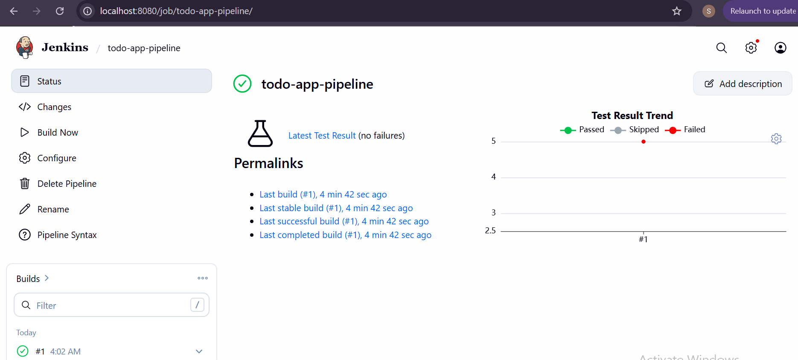
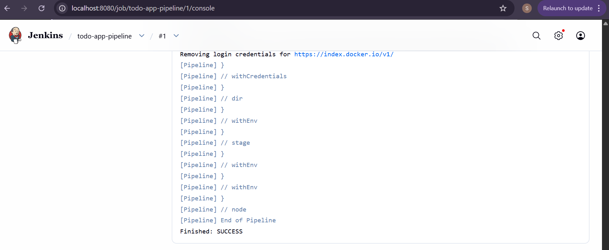
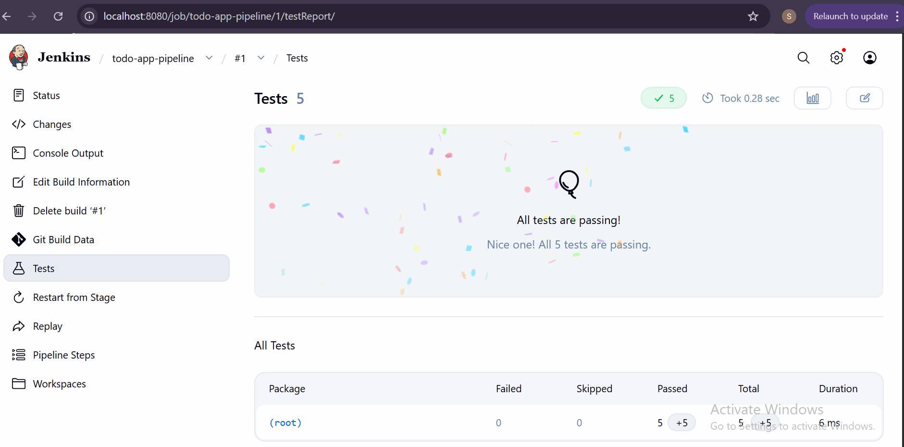
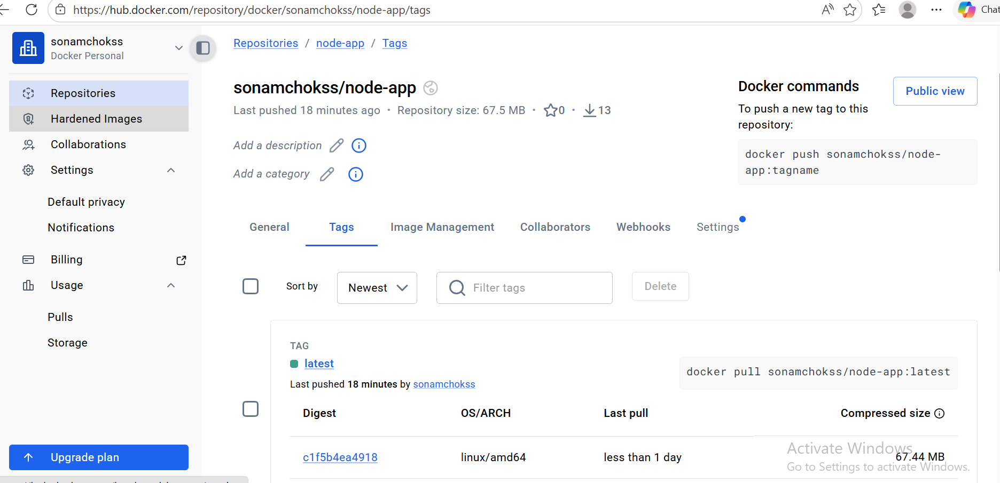

# Assignment II – CI/CD Pipeline with Jenkins

## Overview
This assignment extends the to-do list application built in Assignment 1 by integrating a full **CI/CD pipeline** using Jenkins. The pipeline automates the following stages every time code is pushed to the GitHub repository:

- **Code checkout** from GitHub
- **Dependency installation** using npm
- **Build step** (TypeScript/Webpack compilation)
- **Unit testing** using Jest with JUnit report output
- **Deployment** via Docker (image built and pushed to Docker Hub)

---

## Tools & Technologies Used

| Tool | Purpose |
|------|---------|
| **Jenkins** | CI/CD automation server |
| **GitHub** | Source code hosting and version control |
| **Node.js & npm** | JavaScript runtime and package management |
| **Jest** | Unit testing framework |
| **jest-junit** | JUnit XML report generation for Jenkins |
| **Docker** | Containerization and image deployment |
| **Docker Hub** | Remote container image registry |

---

## Screenshots

### 1. Successful Pipeline Execution


### 2. Console Output


### 3. Test Results in Jenkins


### 4. Docker Hub Image


---

## Pipeline Configuration
 
### Step 1 – Jenkins Installation
Jenkins was downloaded and installed on Windows. It runs locally at `http://localhost:8080` as a Windows service. Java JDK 17 was installed as a prerequisite.
 
### Step 2 – Plugins Installed
The following plugins were installed via **Manage Jenkins → Plugins → Available plugins**:
 
- **NodeJS Plugin** – enables npm commands in pipeline stages
- **Pipeline** – enables declarative Jenkinsfile-based pipelines
- **GitHub Integration** – connects Jenkins with GitHub
- **Docker Pipeline** – enables Docker build and push steps

### Step 3 – Node.js Tool Configuration
Node.js was configured under **Manage Jenkins → Tools → NodeJS** with the name `NodeJS` (matching exactly what is referenced in the Jenkinsfile tools block).
 
### Step 4 – GitHub Credentials Setup
A GitHub Personal Access Token (PAT) was generated at `https://github.com/settings/tokens` with `repo` and `admin:repo_hook` permissions and added to Jenkins via **Manage Jenkins → Credentials → Username & Password** with ID `github-pat`.
 
### Step 5 – Docker Hub Credentials Setup
A Docker Hub Personal Access Token was generated at `https://hub.docker.com/settings/security` with Read & Write permissions and added to Jenkins via **Manage Jenkins → Credentials → Username & Password** with ID `docker-hub-creds`.
 
### Step 6 – Pipeline Job Creation
A new Pipeline job named `todo-app-pipeline` was created in Jenkins with:
- **Definition:** Pipeline script from SCM
- **SCM:** Git
- **Repository URL:** `https://github.com/sonamchokss/sonamchoki_02240361_DSO101_A1`
- **Credentials:** github-pat
- **Branch:** `*/main`
- **Script Path:** `Jenkinsfile`

---

## Challenges Faced
 
### 1. NodeJS Tool Not Configured
**Problem:** Pipeline failed immediately with `Tool type "nodejs" does not have an install of "NodeJS" configured`.  
**Solution:** Configured Node.js under **Manage Jenkins → Tools → NodeJS** with the exact name `NodeJS` matching the Jenkinsfile.
 
### 2. `sh` Command Not Found on Windows
**Problem:** Jenkins threw `Cannot run program "sh" — CreateProcess error=2` because `sh` is a Linux command and Jenkins was running on Windows.  
**Solution:** Replaced all `sh` commands with `bat` throughout the Jenkinsfile since Windows uses batch commands.
 
### 3. package.json Not Found
**Problem:** `npm error enoent Could not read package.json` because the app's `package.json` was inside `todo-app/backend/` not at the repo root.  
**Solution:** Wrapped all npm commands inside `dir('todo-app/backend') { }` blocks in the Jenkinsfile so Jenkins runs commands from the correct subfolder.
 
### 4. Build Stage Hanging Forever
**Problem:** The Build stage never finished because `npm run build` was configured to run `node server.js` which starts the server and runs indefinitely — Jenkins waited forever for it to complete.  
**Solution:** Changed the build script in `package.json` to `echo Build complete` and updated the Jenkinsfile accordingly.
 
### 5. No Tests Found
**Problem:** Jest exited with code 1 saying `No tests found` because there were no test files in the project.  
**Solution:** Created `todo-app/backend/__tests__/app.test.js` with 5 unit tests covering basic todo app functionality.
 
### 6. GitHub Not Reachable
**Problem:** `fatal: unable to access — Could not resolve host: github.com` caused by the college network blocking GitHub.  
**Solution:** Switched to a mobile hotspot which allowed Jenkins to reach GitHub successfully.
 
### 7. Docker Hub Authorization Failed
**Problem:** `push access denied — insufficient_scope: authorization failed` when trying to push the Docker image.  
**Solution:** Generated a Docker Hub Personal Access Token and added it to Jenkins credentials with ID `docker-hub-creds`. Updated the Jenkinsfile Deploy stage to use `withCredentials` to securely inject the login details before pushing.
 
---

## GitHub Repository

> 🔗 **Repository URL:** `https://github.com/sonamchokss/sonamchoki_02240361_DSO101_A1`

---

## Docker Hub Image

> 🐳 **Docker Hub:** `https://hub.docker.com/r/sonamchokss/node-app`

The image tagged `latest` is automatically built and pushed on every successful pipeline run. To pull and run the image locally:

```bash
docker pull sonamchokss/node-app:latest
docker run -p 3000:3000 sonamchokss/node-app:latest
```