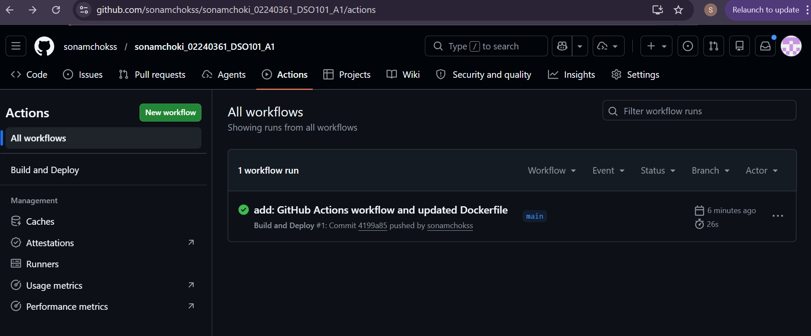
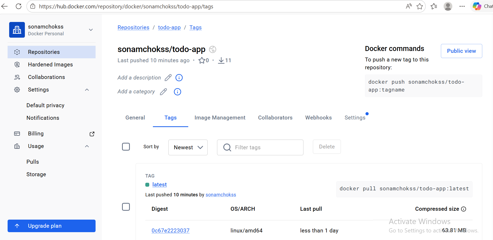
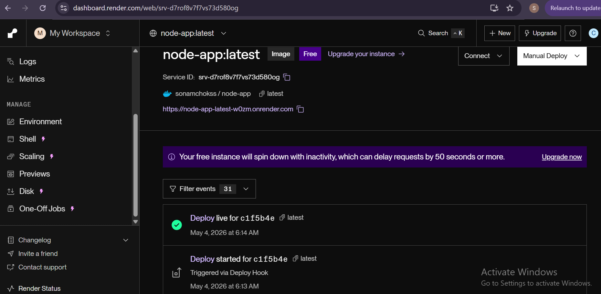
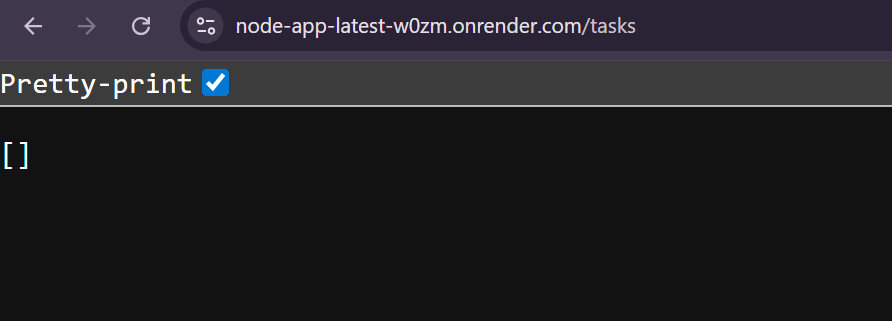

# Assignment III – GitHub Actions CI/CD with Docker and Render

## Overview

This assignment extends the to-do list application from Assignment 1 by setting up a fully cloud-based CI/CD pipeline using **GitHub Actions**. Unlike Assignment 2 which used Jenkins running locally, this pipeline runs entirely in the cloud — automatically building, pushing, and deploying the application whenever code is pushed to the `main` branch.

The pipeline automates the following:
- **Building** a Docker image of the Node.js backend
- **Pushing** the image to Docker Hub
- **Deploying** the container automatically to Render.com via a deploy webhook

---

## Tools & Technologies Used

| Tool | Purpose |
|------|---------|
| **GitHub** | Source code hosting and version control |
| **GitHub Actions** | Cloud-based CI/CD automation |
| **Docker** | Containerization of the Node.js app |
| **Docker Hub** | Remote container image registry |
| **Render.com** | Cloud deployment platform |
| **Node.js & npm** | Backend runtime and package management |
| **Jest** | Unit testing framework |

---

## Repository Structure

```
SONAMCHOKI_02240361_DSO101_A1/
├── .github/
│   └── workflows/
│       └── deploy.yml              ← GitHub Actions workflow
├── todo-app/
│   ├── backend/
│   │   ├── __tests__/
│   │   │   └── app.test.js
│   │   ├── node_modules/
│   │   ├── .env
│   │   ├── Dockerfile              ← Docker build instructions
│   │   ├── package.json
│   │   ├── package-lock.json
│   │   └── server.js
│   └── frontend/
├── screenshots/
│   ├── 1_github_actions_success.png
│   ├── 2_dockerhub_image.png
│   ├── 3_render_deployment.png
│   └── 4_app_live.png
└── README.md
```

---

## Steps Taken

### Task 1 - Verified GitHub Repository Setup
- Confirmed the repository is **public** at `https://github.com/sonamchokss/sonamchoki_02240361_DSO101_A1`
- Verified `package.json` inside `todo-app/backend/` has the correct scripts:

```json
"scripts": {
    "start": "node server.js",
    "test": "jest --ci --reporters=default --reporters=jest-junit",
    "build": "echo Build complete"
}
```

---

### Task 2 - Verified Dockerfile
Confirmed and updated the `Dockerfile` inside `todo-app/backend/` to match the required structure:

```dockerfile
FROM node:20-alpine
WORKDIR /app
COPY package*.json ./
RUN npm install
COPY . .
EXPOSE 10000
CMD ["npm", "start"]
```

The port was set to `10000` to match Render.com's default port assignment.

---

### Task 3 - Created GitHub Actions Workflow
Created `.github/workflows/deploy.yml` at the root of the repository with the full build, push, and deploy pipeline.

Added the following **GitHub Secrets** under repository **Settings → Secrets and variables → Actions**:

| Secret Name | Purpose |
|-------------|---------|
| `DOCKERHUB_USERNAME` | Docker Hub username (`sonamchokss`) |
| `DOCKERHUB_TOKEN` | Docker Hub Personal Access Token |
| `RENDER_DEPLOY_HOOK_URL` | Render.com deploy webhook URL |

> No credentials were hardcoded in any file - all sensitive values are stored as GitHub Secrets and referenced using `${{ secrets.SECRET_NAME }}` syntax.

---

### Task 4 - Deployed on Render.com
1. Created a new **Web Service** on Render.com
2. Selected **"Deploy an existing image from a registry"**
3. Used the Docker Hub image: `sonamchokss/todo-app:latest`
4. Configured the service with port `10000`
5. Copied the **Deploy Hook URL** from Render Settings and added it as `RENDER_DEPLOY_HOOK_URL` in GitHub Secrets

Every push to `main` now automatically triggers a full rebuild and redeployment.

---

## Challenges Faced

### 1. Blank Page at Root URL
**Problem:** Visiting `https://node-app-latest-w0zm.onrender.com` showed `Cannot GET /` because the Express server had no route defined for `/`.  
**Solution:** Added a root route to `server.js` that returns a JSON health check response. The `/tasks` endpoint confirmed the app was fully working even before the root route was added.

### 2. Port Mismatch Between Docker and Render
**Problem:** The Dockerfile originally exposed port `5000` but Render.com assigns port `10000` by default, causing the service to not respond correctly.  
**Solution:** Updated the `Dockerfile` to `EXPOSE 10000` and added a `PORT` environment variable in Render's environment settings so the app binds to the correct port.

### 3. Render Not Automatically Redeploying
**Problem:** Render.com does not automatically pull and redeploy a new Docker image when it is pushed to Docker Hub — it needs to be explicitly triggered.  
**Solution:** Used Render's **Deploy Hook URL** feature. Added the webhook URL as a GitHub Secret and called it using `curl -X POST` in the GitHub Actions workflow as the final deployment step.

### 4. Docker Hub Token vs Password
**Problem:** Using the Docker Hub account password directly in GitHub Secrets caused authentication issues.  
**Solution:** Generated a **Personal Access Token** from Docker Hub (Settings → Security → New Access Token) with Read & Write permissions and used that as `DOCKERHUB_TOKEN` instead.

---

## Learning Outcomes

- Understood the difference between **self-hosted CI/CD** (Jenkins) and **cloud-based CI/CD** (GitHub Actions) and when to use each.
- Learned how to write a **GitHub Actions workflow** using YAML syntax with multiple steps and jobs.
- Learned how to securely manage credentials using **GitHub Secrets** instead of hardcoding them.
- Understood how **Docker images** are built, tagged, and pushed to a registry as part of an automated pipeline.
- Learned how to deploy a containerized application to **Render.com** and trigger redeployments automatically via webhook.
- Understood how Express.js backend APIs work without a frontend — the API is accessible at specific endpoints like `/tasks` rather than at the root URL.

---

## Screenshots

### 1. Successful GitHub Actions Workflow


### 2. Docker Hub Image Pushed


### 3. Render.com Deployment Live


### 4. App Live - API Responding


---

## GitHub Repository

🔗 **Repository URL:** https://github.com/sonamchokss/sonamchoki_02240361_DSO101_A1

---

## Docker Hub Image

🐳 **Docker Hub:** https://hub.docker.com/r/sonamchokss/todo-app

---

## Live Deployment

🌐 **Live API URL:** https://node-app-latest-w0zm.onrender.com

| Endpoint | Method | Description |
|----------|--------|-------------|
| `/tasks` | GET | Returns all tasks |
| `/tasks` | POST | Adds a new task |
| `/tasks/:id` | DELETE | Deletes a task by ID |

Test the live API:
```
https://node-app-latest-w0zm.onrender.com/tasks
```
